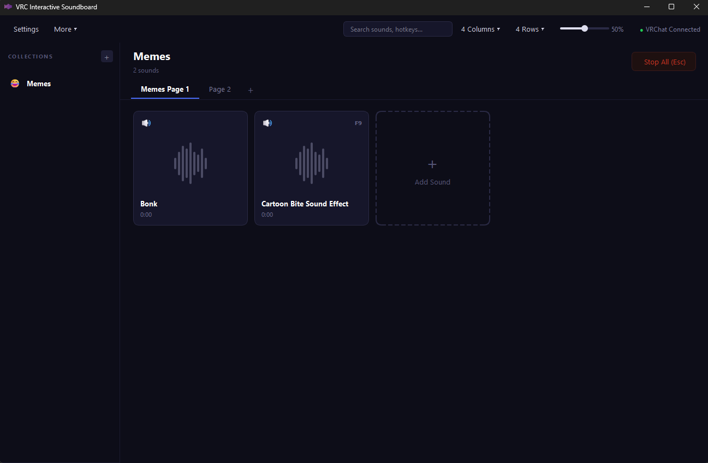
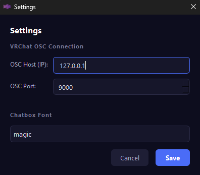
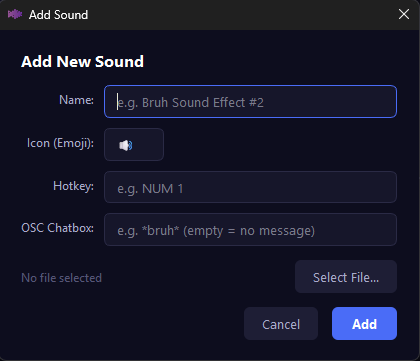

# VRC Interact Soundboard
A specialized soundboard for VRChat — control sound, chatbox messages, and avatar parameters through a single, unified interface.


## Features
* **Collections**: Organize sounds into logical groups (e.g., Gaming Memes, Roleplay FX, etc.).
* **Pages**: Support for multiple pages per collection for maximum organization.
* **Audio Playback**: Support for MP3, WAV, OGG, and FLAC via click or customizable hotkeys.
* **OSC Chatbox**: Automatically send custom messages to the VRChat chatbox whenever a sound is played.
* **VRChat Status**: Real-time indicator showing if the VRChat OSC connection is active.
* **Search**: Quickly find specific sounds by name.
* **Settings**: Fully configurable OSC Host/Port and Chatbox Font settings.

---

## Interface Overview
The main interface provides quick access to your collections, pages and sounds.



---

## Installation

### Prerequisites
* **Python 3.11** or higher is required.

### Steps
1.  **Install dependencies:**
    ```bash
    pip install -r requirements.txt
    ```

2.  **Launch the application:**
    ```bash
    python main.py
    ```

---

## VRChat OSC Setup
To allow the soundboard to communicate with VRChat, follow these steps:

1.  **In VRChat:** Go to `Settings -> OSC -> Enable`.
2.  **Default Connection:** Use Port `9000` and Host `127.0.0.1`.
3.  **In the Soundboard:** Navigate to the Settings window to verify your OSC configuration and customize your Chatbox font.



---

## Adding Sounds
1.  Select a **Collection** from the left-hand sidebar.
2.  Click the **"+" / "Add Sound"** button.
3.  In the configuration window, set the following:
    * **Name & Icon**: Choose a display name and an Emoji icon.
    * **Hotkey**: Assign a keyboard shortcut for quick triggering.
    * **OSC Chatbox Message**: (Optional) Text to be sent to VRChat when the sound plays.
    * **File**: Select your audio file.



---

## Data & Configuration
All your settings, collections, and sound mappings are stored locally in:
`vrc-interactive-soundboard-cfg.json` 
inside the program folder. Back up this file to save your configurations or share it with others!